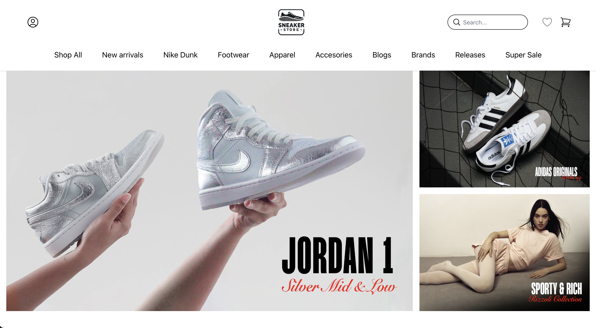

# Sneaker Store
This app is a mockup UI of a sneaker store online webshop.

## Description 
Sneaker Store is a mock e-commerce user interface designed for browsing, searching, and managing a cart of sneakers. The application is built using React.js and styled with Tailwind CSS.

## Features
- Browse a collection of sneakers
- Search functionality to filter sneakers by name
- Add and remove sneakers from a shopping cart

## App Preview:


### Prerequisites

- [Node.js](https://nodejs.org/) (v18 or higher recommended)
- [npm](https://www.npmjs.com/) or [yarn](https://yarnpkg.com/) installed

---

## Frontend Setup

1. **Clone the repository:**

   ```bash
   git clone https://github.com/your-username/sneaker-store.git
   cd sneaker-store

2. **Install Dependencies:**
   ```bash
   npm install
   ```
   Or with yarn:
   ```bash
   yarn
   ```
3. **Start the frontend development server:**
   ```bash
   npm run dev
   ```
   This will launch the app at http://localhost:5173

---

## Backend Setup
The backend is a basic Express.js server user for serving sneaker data.
1. **Navigate to the backend directory:**
   ```bash
   cd backend
   ```
   
2. **Install backend dependencies:**
   ```bash
   npm install
   ```
   
3. **Start the backend server:**
   ```bash
   node index.js
   ```
   The backend will run at http://localhost:5001


  


